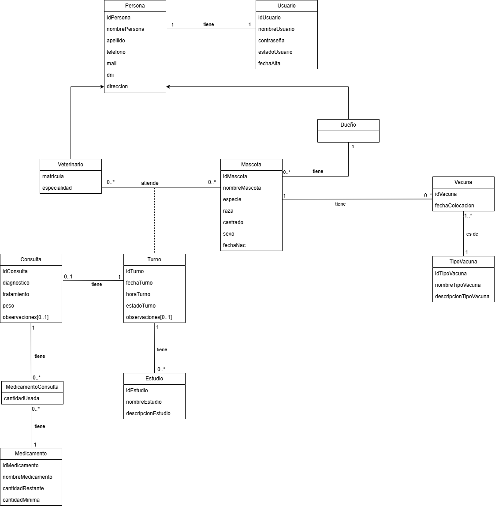

# Trabajo Práctico Integrador

## Integrantes:
* 54280 - Squarzon, Nicolás José
* 54448 - Grieco, Giuliana
* 55160 - Corbella, Leonardo 

## Descripción General del Sistema
### Sistema de Gestión Veterinaria
El **Sistema de Gestión Veterinaria (SGV)** registra y administra las actividades clínicas y operativas de la clínica en torno a las entidades principales de Dueños, Mascotas, Veterinarios, Turnos y Medicamentos.

Tanto los **Dueños** como los **Veterinarios** tienen datos en común, tales como DNI, Nombre, Apellido, Dirección, Teléfono y Email, entre otros. 

Las **Mascotas** pertenecen a un único Dueño y tienen características propias como Especie, Raza y Fecha de Nacimiento. Su historial clínico se conforma mediante la aplicación de Vacunas y la realización de Estudios.

El acceso a las distintas funcionalidades está restringido mediante **Roles** (por ejemplo, Administrador/Recepcionista y Veterinario).

Para la atención, la clínica gestiona **Turnos**, donde se asocia una **Mascota** con un **Veterinario** en una fecha y hora específicas.

Al concretarse la atención clínica, el **Veterinario** debe registrar la **Consulta** en el sistema. En este acto, el **Veterinario** detalla el diagnóstico, el tratamiento, el peso registrado y los **Medicamentos** utilizados o recetados. 

Teniendo en cuenta este modelo las funcionalidades a implementar son las siguientes:

## Alcance Funcional y Requerimientos

### Requerimientos Funcionales Implementados
1.  Alta, Baja, Modificaciones y Consulta de Usuarios
2. Alta, Baja, Modificaciones y Consulta de Veterinarios 
3. Alta, Baja, Modificaciones y Consulta de Dueños
4. Alta, Baja, Modificaciones y Consulta de Turnos
5. Alta, Baja, Modificaciones y Consulta de Mascotas
1. Alta, Baja, Modificaciones y Consulta de Estudios
1. Alta, Baja, Modificaciones y Consulta de Vacunas
6. Registro de Consultas y Medicamentos utilizados
7. Reporte de Consultas y Vacunas
8. Reporte de Turnos	
9. Reporte de stock de Medicamentos

## Modelo del Dominio

